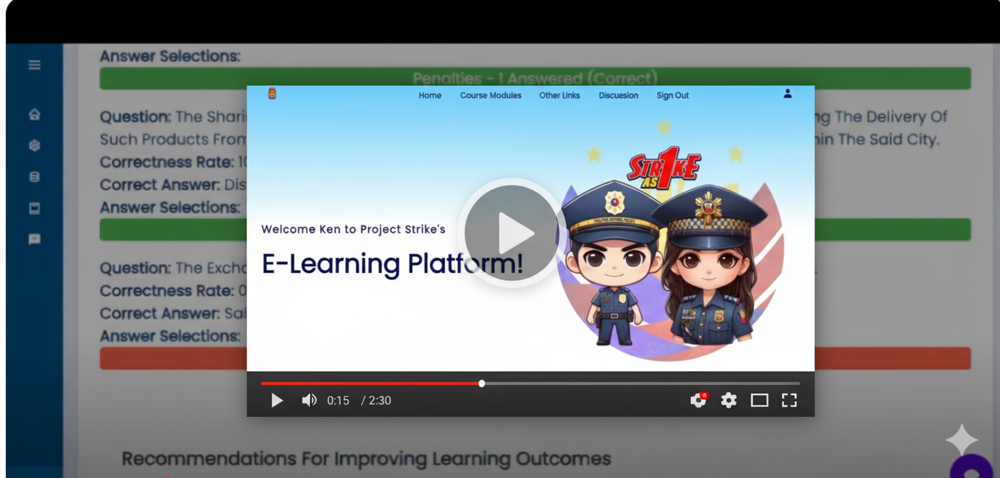
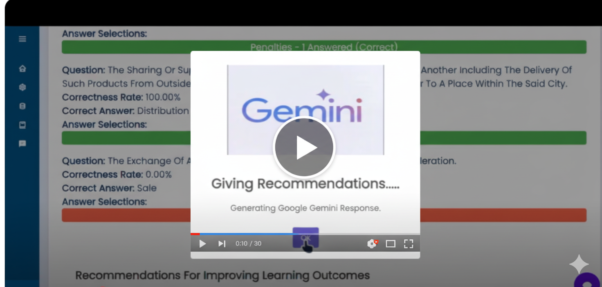

# Guardian Gauge V2 – AI-Powered Learning Management System

A full-stack Learning Management System designed, built, and deployed for 100+ personnel across the Philippine National Police (PNP), Bureau of Fire Protection (BFP), and Bacoor Traffic Management Department.

Built to replace manual training tracking, the system centralizes learning, enables real-time collaboration, and introduces AI-powered assistance for scalable and measurable training operations.

---

## 📌 Problem
Training workflows were:

- Manual and inconsistent
- Difficult to track and evaluate
- Lacking real-time feedback and visibility

---

## 💡 Solution
Developed a centralized LMS that:

- Standardizes training delivery and assessment
- Provides real-time collaboration via discussion forums
- Enables performance tracking through analytics dashboards
- Integrates AI (Gemini) for real-time assistance and recommendations

---

## ✨ Features
- **Role-Based Authentication** – Secure login with Firebase Auth  
- **Personnel Dashboard** – Access learning modules, take exams, join discussions  
- **Admin Panel** – Manage users, track compliance, generate reports  
- **Course Modules & Exams** – Multimedia learning materials, automated grading  
- **Reports** – Admin reports for monitoring performance and compliance  
- **AI Chatbot & Recommendations** – Integrated with **Gemini API** for Q&A and module suggestions  
- **Discussion Forum** – Real-time, Reddit-style forum for collaboration  
- **Analytics Dashboards** – Data visualization of training outcomes and personnel performance  

---

## 🛠️ Tech Stack
- **Frontend:** HTML, CSS, JavaScript  
- **Backend:** Node.js  
- **Database & Auth:** Firebase (Firestore, Realtime DB, Firebase Auth)
- **Deployment:** FIrebase Functions and Firebase Hosting 
- **AI:** Google Cloud Gemini API  
- **Version Control:** Git, GitHub  
- **Methodology:** Agile, iterative prototyping  

---

## 👩‍💻 My Contributions
Since this was a **group project (4 members)**, here are the major features I personally built and contributed to:

- 🔹 **AI Integration** – Connected Gemini API for chatbot Q&A and personalized recommendations  
- 🔹 **Discussion Forum** – Implemented real-time, Reddit-style discussion board for personnel  
- 🔹 **Admin Backend Logic** – Built features for managing users, modules, and reports  
- 🔹 **Course Modules & Exams** – Developed module delivery, exam system, and automated grading  
- 🔹 **Reports** – Designed report generation for admins (compliance, performance tracking)  
- 🔹 **Analytics Dashboards** – Created data visualization for performance analytics  

---

## 🏗️ System Architecture
- **Personnel Flow:** Register/Login → Access Dashboard → Take Course → Exam → Feedback → Forum  
- **Admin Flow:** Login → Manage Personnel & Modules → Track Compliance → Generate Reports → Review Analytics  

**Personnel**

**Admin**

---

## 🎥 Demo
- **Presenter:** Derez

**Personnel Demo**  

**Admin Demo**  

---

## 📊 Results
- **ISO 25010 Evaluation:** Overall system quality rated **4.42 (Excellent)**  
- **User Acceptance Testing:** Rated **4.41 (Very Acceptable)** by personnel  
- **Impact:** Successfully deployed to **100+ enforcement personnel** in Bacoor  

---

## 🚀 Future Enhancements
- Independent **mobile application** version (since it is only web-based) 
- Course calendar & notification inbox  
- Walkthrough/tutorial for first-time users  
- Expanded AI features for personalized training  

---

## 🙏 Acknowledgment
This was a **capstone project** developed by:  
- Derez  
- **Manabat** (myself)  
- Mercader  
- Silawan  

---
